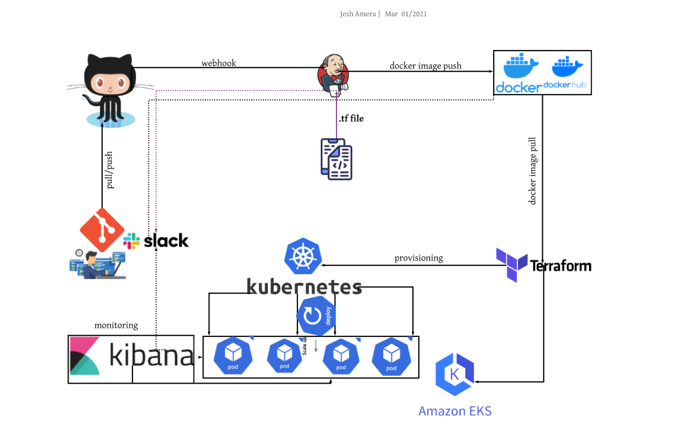
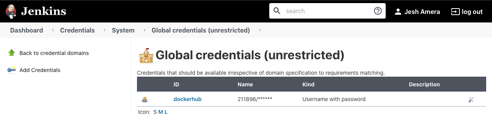
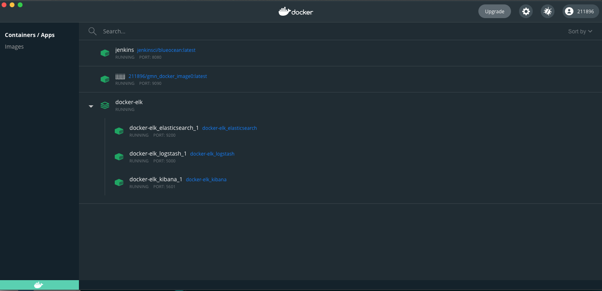
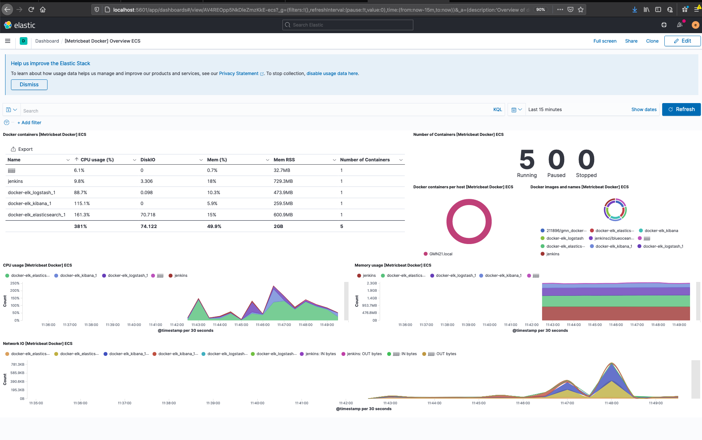
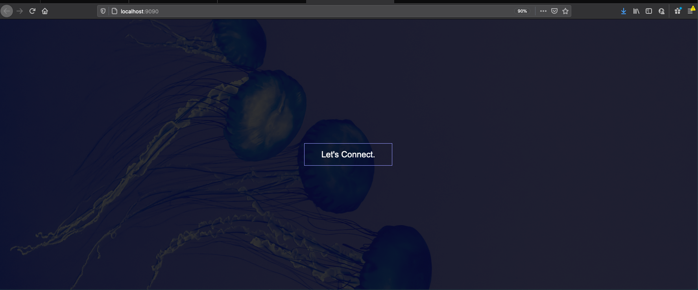
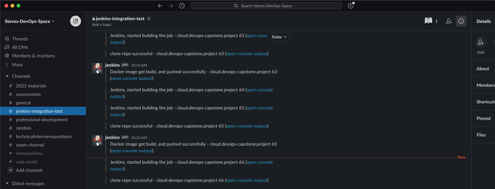
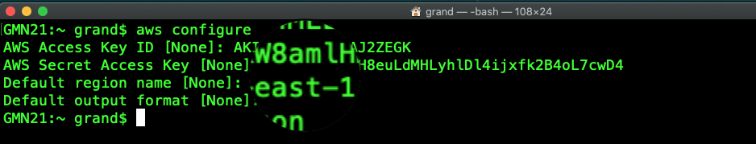
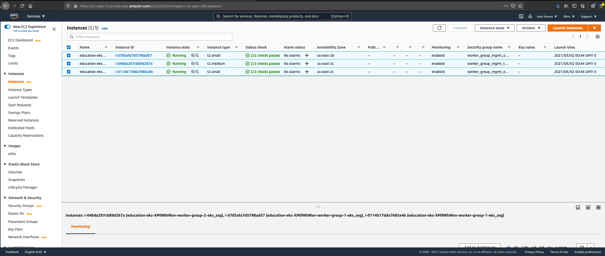
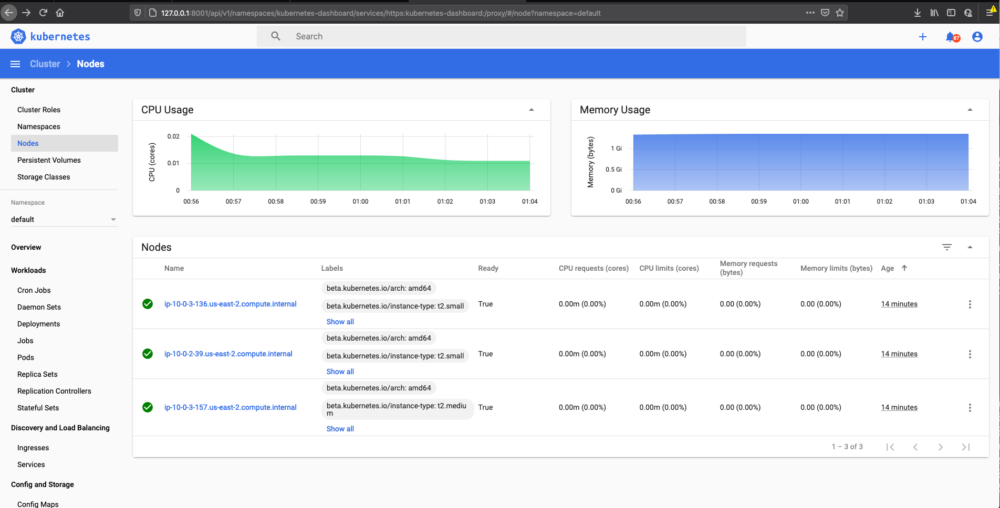

### [Click here for full instruction](https://docs.google.com/document/d/1J5rvYyM-EjEq1GFcrTuVrwn6q1INIp6U6J1MS3OhOJM/edit)
## [Cloud DevOps Capstone Project (Provisioning and Monitoring)]()

## Step 1. Design, plan, and overview of the project
    



 	  
## Step 2. Install and configure some DevOps tools/plugins

* Git, GitHub
* slack
* Jenkins
* Docker
* Docker Hub
* Terraform
* Kubernetes/Minikube
* AWS(EKS, EC2)

> Install git 

```
$ brew install git or brew install git-gui
$ git --version

```
> Install Jenkins 

```
$ brew install jenkins | or
$ brew install jenkins-lts | or
$ docker run -u root -d -p 8080:8080 -p 50000:50000 -v ~/Docker/Jenkins:/var/jenkins_home 
    -v /var/run/docker.sock:/var/run/docker.sock --name jenkins jenkinsci/blueocean
$ jenkins --version

```
> Install JDK

```
$ brew tap adoptopenjdk/openjdk
$ java -version

```
> Install Docker Desktop/Dockercli 

```
$ brew install docker
$ docker --version

```
> Install kubclt/minikube 

```
$ brew install kubernetes-cli
$ brew snap install kubectl --classic
$ kubectl version --client

$ brew install minikube
$ brew unlink minikube
$ brew link minikube
$ minikube version
$ minikube start

```
> Install Terraform

```
$ brew install terraform | or
$ brew tap hashicorp/tap
$ brew install hashicorp/tap/terraform
$ brew install kind
$ terraform --version

```
## Step 3. Testing, Building, Staging, and Provisioning 

### Part 1. Create Dockerized Jenkins

> docker run -u root -d -p 8080:8080 -p 50000:50000 -v ~/Docker/Jenkins:/var/jenkins_home 
		    -v /var/run/docker.sock:/var/run/docker.sock --name jenkins jenkinsci/blueocean



[Dockerfile](https://github.com/simulationpoint/cloud.devops-capstone.project/blob/main/Dockerfile)

   
### Part 2. Create CI/CD pipelines using Jenkins

[Jenkinsfile](https://github.com/simulationpoint/cloud.devops-capstone.project/blob/main/Jenkinsfile)
   
### Part 3. Create terrafrom provisioning file 

[Terraform](https://github.com/simulationpoint/cloud.devops-capstone.project/blob/main/main.tf)
 
### Part 4. Create Kubernetes cluster using terrafrom as provisioner

[Kubernetes](https://github.com/simulationpoint/cloud.devops-capstone.project/blob/main/kubernetes.yaml)

### Part 4. Create dockerized ELK stack to monitor the falsk app







### Part 5. Configure and integrate slack notification in Jenkins, Kibana
[Instruction found here](https://github.com/simulationpoint/cloud.devops-capstone.project/blob/main/slack.md)
  

   
## Step 4. Cloud implementation using terraform

> ####  Cloud implementation on (AWS - EKS, EC2)







## Summary

* The challenge was Jenkins crashed for no reason after some plugin install
* Cloud implementation was great but, `expensive` ! 
* brew uninstall jenkins --force | temporary work and CRASHED AGAIN !! 
* brew cleanup
* Result 


> #### [Project Link](https://github.com/simulationpoint/cloud.devops-capstone.project)

## References

👉 [https://github.com/simulationpoint/dockerized-elk](https://github.com/simulationpoint/dockerized-elk)

👉 [https://curriculeon.github.io/Curriculeon/lectures/containerization/docker/dockerizing-jenkins/instructions-linux.html](https://curriculeon.github.io/Curriculeon/lectures/containerization/docker/dockerizing-jenkins/instructions-linux.html)

👉 [https://github.com/simulationpoint/terraform/tree/main/jesh](https://github.com/simulationpoint/terraform/tree/main/jesh)

