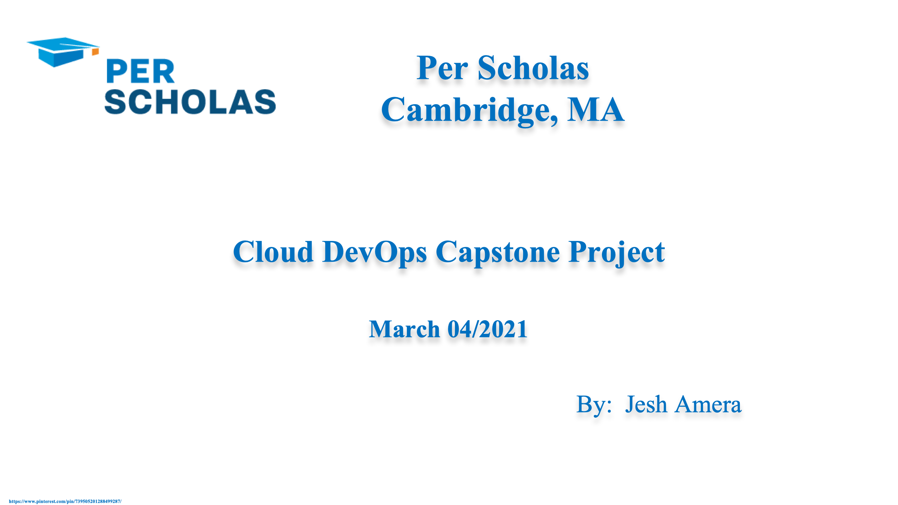

## <button> [Click here for full instruction](https://docs.google.com/document/d/1J5rvYyM-EjEq1GFcrTuVrwn6q1INIp6U6J1MS3OhOJM/edit)
## [Cloud DevOps Capstone Project (Provisioning and Monitoring)]()

## Step 1. Designe, plan, and overview of the project
    


 	  
## Step 2. Install, run, and configure some DevOps tools/plugins

* Git, GitHub
* slack
* Webhook
* Jenkins
* Docker
* Docker Hub
* Terraform
* Kubernetes/Minikube
* AWS(EKS)

> Install git 

```
$ brew install git or brew install git-gui
$ git --version

```
> Install Jenkins 

```
$ brew install jenkins | or
$ brew install jenkins-lts | or
$ docker run -u root -d -p 8080:8080 -p 50000:50000 -v ~/Docker/Jenkins:/var/jenkins_home 
    -v /var/run/docker.sock:/var/run/docker.sock --name jenkins jenkinsci/blueocean
$ jenkins --version

```
> Install JDK

```
$ brew tap adoptopenjdk/openjdk
$ sudo apt search openjdk
$ sudo apt install openjdk-11-jdk
$ sudo systemctl status jenkins
$ java -version

```
> Install Docker Desktop/Dockercli 

```
$ brew install docker
$ docker --version

```
> Install kubclt/minikube 

```
$ brew install kubernetes-cli
$ brew snap install kubectl --classic
$ kubectl version --client

$ brew install minikube
$ brew unlink minikube
$ brew link minikube
$ minikube version
$ minikube start

```
> Install Terraform

```
$ brew tap hashicorp/tap
$ brew install hashicorp/tap/terraform
$ brew install kind
$ terraform --version

```
## Step 3. Testing, Building, Staging, and Provisioning 

### Part 1. Create Dockerized Jenkins

[Dockerfile](https://github.com/simulationpoint/Cloud-DevOps-Engineer-Capstone-Project/blob/master/Dockerfile)

   
### Part 2. Create CI/CD pipelines using Jenkins

[Jenkinsfile](https://github.com/simulationpoint/Cloud-DevOps-Engineer-Capstone-Project/blob/master/Jenkinsfile)
   
* Run the pipeline from Blue Ocean plugin of Jenkins

   
### Part 3. Create terrafrom provissioning file 

[Terraform](https://github.com/simulationpoint/Cloud-DevOps-Engineer-Capstone-Project/blob/master/kubernetes.yaml)
 
### Part 4. Create Kubernetes cluster using terrrafrom as provisioner
  


### Part 4. Create dockerized ELK stack to monitor the falsk app
  

   
## Step 4. Cloud implementation using terraform

* Cloud implementation on (AWS - EKS)


## Summary
* The challenge was ...     
* brew uninstall jenkins --force
* brew cleanup

> #### [Project Link](https://github.com/simulationpoint/cloud.devops-capstone.project)


### <span style="color:green"> 👍 Congratulations you have made it this far!</span> 

## References

👉 [https://github.com/simulationpoint/dockerized-elk](https://github.com/simulationpoint/dockerized-elk)

👉 [https://curriculeon.github.io/Curriculeon/lectures/containerization/docker/dockerizing-jenkins/instructions-linux.html](https://curriculeon.github.io/Curriculeon/lectures/containerization/docker/dockerizing-jenkins/instructions-linux.html)

👉 [https://github.com/simulationpoint/terraform/tree/main/jesh](https://github.com/simulationpoint/terraform/tree/main/jesh)

👉 [hhg](https://github.com/simulationpoint/cloud.devops-capstone.project)

👉 [https://github.com/simulationpoint/Cloud-DevOps-Engineer-Capstone-Project/blob/master/kubernetes.yaml](https://github.com/simulationpoint/Cloud-DevOps-Engineer-Capstone-Project/blob/master/kubernetes.yaml)

👉 [https://github.com/simulationpoint/Cloud-DevOps-Engineer-Capstone-Project/blob/master/kubernetes.yaml](https://github.com/simulationpoint/Cloud-DevOps-Engineer-Capstone-Project/blob/master/kubernetes.yaml)


   	   
